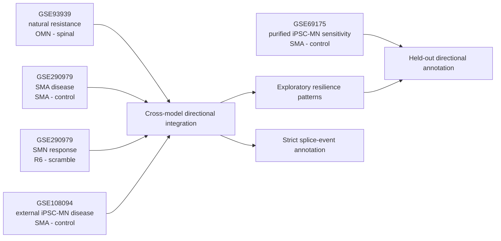

# Cross-Model Human Motor-Neuron Resilience Analysis

**Analysis date:** 31 July 2026
**Status:** reproducible exploratory integration; not clinical evidence

## Executive Decision

GSE93939 is retained as a core dataset. Its role is upgraded from a standalone
"OMN resilience analysis" to the **natural-resistance anchor** within a
**cross-model human motor-neuron resilience analysis**.

The framework has three scored human models plus one held-out sensitivity
model:

| Dataset | Model role | Libraries | Independent units | What it contributes |
| --- | --- | ---: | ---: | --- |
| GSE93939 | Natural-resistance anchor | 39 total; 32 in OMN versus spinal | 19 donors | Direction of expression associated with relatively resistant human oculomotor neurons |
| GSE290979 | Human SMA disease and SMN-response model | 31 | 5 iPSC lines overall; 2 SMA treatment lines | Disease direction, R6-MO response, and strict splice restoration |
| GSE108094 | External iPSC-SMA motor-neuron validation | 8 | 4 iPSC-MN lines | Independent SMA-versus-control direction in spinal motor neurons |
| GSE69175 | Purified iPSC-SMA motor-neuron sensitivity | 4 | 2 lines total; 1 control and 1 SMA | Additional disease direction without line-independent replication |

The models are analyzed separately. Samples are never batch-corrected and
pooled into one artificial cohort because tissue source, cell composition,
platform, reference annotation, and biological design differ substantially.
Integration occurs only after model-specific effects are oriented and mapped
to current HGNC symbols.



## 1. Why GSE93939 Must Not Be Discarded

GSE93939 answers a question no SMA organoid dataset can answer directly: which
expression directions distinguish a relatively resistant human motor-neuron
population from vulnerable spinal motor neurons in vivo.

Its adjusted R analysis has no OMN-positive gene at FDR 0.05. That limits
single-gene certainty, but it does not make the dataset irrelevant. It remains
useful as:

- a directional natural-resistance prior;
- a source of effect ranks rather than a binary hit list;
- a human anatomical counterpoint to disease models; and
- a filter for hypotheses that recur in independent SMA systems.

The analysis retains donor blocking, TMM/voom modeling, covariate adjustment,
same-platform sensitivity analysis, and donor-pseudobulk sensitivity. The high
FDR values remain visible in every candidate table.

## 2. External Validation Roles

### GSE108094 primary external direction

[GSE108094](https://www.ncbi.nlm.nih.gov/geo/query/acc.cgi?acc=GSE108094)
contains eight deeply sequenced human iPSC-derived spinal motor-neuron
libraries:

- two control motor-neuron lines with two replicate libraries each;
- two SMA motor-neuron lines with two replicate libraries each;
- paired-end 2 x 100-bp HiSeq 2000 sequencing; and
- official gene-expression and exon-skipping outputs.

It was selected as the primary external tier over two smaller or less direct
options:

| Dataset | Why not the main external tier |
| --- | --- |
| GSE69175 | Direct and purified patient-derived motor-neuron RNA-seq, but one line per genotype |
| GSE87281 | Seven relevant human iPSC-MN libraries, but SMA biology is modeled by SMN shRNA rather than patient genotype |

GSE108094 still has only four iPSC lines and is not a discovery cohort. The
official Cuffdiff analysis uses four libraries per group even though two
libraries share each line. Its p/FDR values are retained as source context,
but the cross-model analysis uses its effect direction and does not interpret
the libraries as four independent donors per group.

### External-data audit

The R preparation script verifies SHA-256 for the GEO SOFT file and both
supplementary files. It recovers:

- 63,657 official Cuffdiff expression rows;
- 24,691 rows with `status == OK`;
- 1,892 official expression rows with FDR below 0.05;
- 29,237 hg19 exon-skipping rows; and
- 1,947 exon-skipping rows with FDR below 0.05 and absolute delta-PSI above
  0.05.

The Cuffdiff file labels `sample_1 = SMA` and `sample_2 = CTL`, while its
published `log2(fold_change)` is control minus SMA. R verifies this from the
FPKM values and reverses the sign so every project table consistently reports
**SMA minus control**.

The GSE108094 splicing coordinates use hg19 and Ensembl release 75. They are
not claimed to be exact matches to the hg38 GSE290979 events. Exact event
validation requires reference-aware lift-over or raw-read reprocessing.

### GSE69175 constrained sensitivity direction

[GSE69175](https://www.ncbi.nlm.nih.gov/geo/query/acc.cgi?acc=GSE69175) contains
two libraries from one control iPSC line and two libraries from one SMA type I
line after purification of motor neurons. The hash-locked R audit verifies the
deposited SMA-minus-control orientation and provides 5,093 approved direction-
usable genes.

It is not added to the four-component score. Genotype is completely confounded
with line, and LOLO is structurally impossible because either omission removes
one group. Its effect is therefore held out as directional sensitivity
annotation after candidate ranking.

## 3. Cross-Model Integration Method

The four directed components are:

1. **Natural resistance:** GSE93939 OMN minus spinal motor neuron.
2. **Organoid disease opposition:** negative GSE290979 SMA minus control.
3. **SMN-response alignment:** GSE290979 R6-MO minus scramble.
4. **External disease opposition:** negative GSE108094 SMA minus control.

For each component, effects are converted to percentiles among approved HGNC
genes with usable values in all models. The cross-model score is the unweighted
mean of the four percentiles. Equal weighting prevents the much deeper
GSE108094 data or the larger GSE93939 effect scale from dominating solely due
to measurement scale.

The score is a directional integration tool. It is not a combined p value,
causal score, or therapeutic ranking.

No random library split is used. Donor, line, and complete-dataset omissions
are evaluated after the primary effects are fixed.

Because GSE93939 is post-mortem LCM and GSE290979 contains mixed organoid cell
populations, some high directional scores may reflect cell-state or cell-
composition differences. Every proposed perturbation target therefore requires
motor-neuron expression confirmation in an independent cell-type reference
before functional testing.

A full directional resilience pattern requires:

```text
GSE93939 OMN - spinal           > 0
GSE290979 SMA - control         < 0
GSE290979 R6 - scramble         > 0
GSE108094 SMA - control         < 0
```

The inverse pattern is tracked separately as a possible vulnerability program.

## 4. Results

### Analysis universe

- 12,512 genes have all three GSE93939/GSE290979 core effects.
- 11,326 approved HGNC genes also have usable GSE108094 direction and are
  ranked.
- 626 genes have the complete resilience-direction pattern.
- 468 genes have the complete inverse vulnerability-direction pattern.
- 37 of the 626 also meet the frozen exploratory GSE93939 criterion: primary
  OMN `p < 0.05`, positive same-platform effect, and same-platform `p < 0.10`.

No gene in this 37-gene set is called statistically validated by GSE93939,
because its OMN FDR remains high.

### Global concordance

| Comparison | Genes | Spearman rho |
| --- | ---: | ---: |
| GSE93939 natural resistance vs inverted GSE290979 disease | 12,607 | 0.044 |
| GSE93939 natural resistance vs GSE290979 R6 response | 12,546 | -0.079 |
| GSE93939 natural resistance vs inverted GSE108094 disease | 11,822 | 0.051 |
| GSE290979 disease vs GSE108094 disease | 13,276 | -0.045 |
| GSE290979 disease vs inverted R6 response | 16,485 | -0.118 |

The large gene counts make even tiny correlations nominally significant. The
effect sizes show that there is **no strong genome-wide shared signature**.
The value of the cross-model design is therefore focused directional
intersection, not claiming that the models reproduce one another globally.

### Relationship to strict splice restoration

Sixty-five of the 74 strict GSE290979 splice-restoration genes have usable
effects in all models. All 12 frozen primary validation-panel genes and all
three exploratory bridge genes have external GSE108094 direction.

Within the 12-event primary panel:

- **FAT3** and **TNPO2** show the full four-model total-expression direction.
- The other ten remain splice-validation candidates but do not meet all four
  total-expression directions.
- This does not invalidate their splice events; total transcript abundance and
  isoform correction are different biological measurements.

### Focused cross-model bridge

**LINC00665** is the only strict GSE290979 splice-restoration gene among the 37
exploratory natural-resistance plus full-direction candidates.

| Evidence arm | LINC00665 result |
| --- | ---: |
| GSE93939 OMN minus spinal effect | 3.732 |
| GSE93939 primary p / FDR | 0.0243 / 0.763 |
| GSE290979 SMA minus control expression effect | -0.343 |
| GSE290979 R6 minus scramble expression effect | 0.081 |
| GSE108094 SMA minus control effect | -1.480 |
| GSE108094 p / FDR | 0.00095 / 0.0170 |
| Strict splice event | ES; disease dPSI 0.138, R6 dPSI -0.212 |

This makes LINC00665 a coherent **exploratory cross-model hypothesis**, not a
validated neuroprotective target. Its GSE93939 FDR is high, GSE290979
gene-expression effects are not significant, and its splice isoform requires
raw-read and junction-level confirmation.

KCNAB3 and TSPOAP1 retain natural-resistance and external-disease support, but
their GSE290979 total-expression R6 effects do not align with the natural
direction. They remain valid splice-level bridge hypotheses because splice
correction need not follow total expression.

### Cell-resolved refinement

The linked GSE290980 single-cell arm is used for same-study motor-neuron
disease localization, while the independent nine-donor GSE243076 adult spinal-
cord atlas is used only for motor-neuron localization. These roles are not
interchanged.

Five of the 37 exploratory candidates occur in the GSE290980 motor-neuron
pseudobulk DEG list. `PFKFB2` and `SHQ1` have the expected SMA-opposed
direction. Thirty-five are detected in the independent adult C20 motor-neuron
cluster, but none passes the stringent C20-selective localization rule. This
negative specificity result argues against describing the current 37-gene set
as a motor-neuron-specific program. Full details are in
[`cell_resolved_dataset_strategy.md`](cell_resolved_dataset_strategy.md).

### Biological-unit and dataset holdouts

GSE93939 is refit after omitting each of 19 primary donors and each of 13
same-platform donors. GSE290979 disease is refit after omitting each of five
donor lines. Because the treatment arm contains only two SMA lines, S2 and S3
paired effects are reported separately instead of presenting a one-line model
as formal LOLO.

Seven of the 37 exploratory candidates retain direction in all three estimable
unit checks: `LY6H`, `HS3ST5`, `ZNF853`, `PNCK`, `IL17D`, `CLPTM1`, and `PDPR`.
Six different candidates have GSE69175 disease opposition (`ROBO2`, `ATP9B`,
`HEY1`, `LRRC4`, `SPIN1`, `EIF4ENIF1`), leaving zero candidates with both
forms of support.

Ranks are also recomputed after omitting GSE93939, GSE290979, or GSE108094 as a
complete evidence source. Full definitions and limitations are in
[`biological_unit_holdout_validation.md`](biological_unit_holdout_validation.md).

### All-nine raw-read sensitivity confirmation

All nine pre-specified local9 FASTQ pairs passed deposited ENA MD5
verification and were re-quantified with Salmon 1.10.2 against the GENCODE v47
transcriptome. This expedited route retained all five untreated donor lines
and both paired treatment lines without requiring the processed workbook to
create counts.

The raw and processed disease effects matched across 14,636 genes
(`rho = 0.778`; direction agreement 0.807). Treatment effects matched across
14,385 genes (`rho = 0.588`; direction agreement 0.732). Thirty-five of 37
frozen candidates mapped in both contrasts, 21 recovered the full raw
direction pattern, and nine retained that pattern across all five disease
line omissions and both treatment lines.

The original discovery ranks remain frozen. A separate publication evidence
tier places `LY6H`, `HS3ST5`, `ZNF853`, and `IL17D` in Tier 1 because they are
unit-robust in both the processed and raw analyses. Tier 2 contains five
raw-unit-robust candidates (`LSAMP`, `FAAH`, `C12orf60`, `KCNJ4`, `CABLES2`).
Tier 3 contains three processed-unit-robust candidates (`PNCK`, `CLPTM1`,
`PDPR`). No external or same-study cell-resolved annotation is used to
rescore these genes.

The local9 result is same-study raw sensitivity confirmation, not independent
validation. Salmon transcriptome quantification is also not whole-genome
alignment, splice-junction discovery, or SMN1/SMN2 allele-specific analysis.

## 5. Interpretation and Publication Use

The upgraded manuscript framing is:

> Cross-model human motor-neuron resilience analysis integrating natural
> resistance, human SMA disease, SMN-directed response, and independent
> patient-derived motor-neuron validation.

The defensible claim is that complementary human models identify a small set
of recurrent directional hypotheses while also showing substantial
model-specific biology. The analysis should not claim a universal OMN
signature or present the 37 genes as confirmed targets.

The strongest publication structure is:

1. GSE93939 defines natural-resistance direction with donor-aware uncertainty.
2. GSE290979 tests disease opposition, SMN response, and splice restoration.
3. GSE108094 supplies independent iPSC motor-neuron disease direction.
4. GSE69175 supplies a separately labeled purified-MN sensitivity direction
   without being counted as line-independent replication.
5. GSE290980 localizes disease effects by organoid cell type without being
   mislabeled as independent.
6. GSE243076 tests independent adult motor-neuron localization without being
   mislabeled as an SMA contrast.
7. All-nine raw GSE290979 re-quantification tests gene-level reproducibility
   without being mislabeled as independent validation.
8. Full31 genome alignment or orthogonal junction assays remain required for
   workbook-independent splice claims.
9. Raw, processed, GSE69175, and cell-resolved evidence remain visibly
   separated in candidate reporting.

## 6. Reproduce

Run after the existing GSE93939, GSE290979, integration, and panel scripts:

```powershell
& 'C:\Program Files\R\R-4.6.0\bin\Rscript.exe' r\12_prepare_gse108094_external_validation.R
& 'C:\Program Files\R\R-4.6.0\bin\Rscript.exe' r\13_cross_model_human_motor_neuron_resilience.R
& 'C:\Program Files\R\R-4.6.0\bin\Rscript.exe' r\14_gse243076_independent_motor_neuron_atlas.R
& 'C:\Program Files\R\R-4.6.0\bin\Rscript.exe' r\15_gse290980_cell_resolved_sma.R
& 'C:\Program Files\R\R-4.6.0\bin\Rscript.exe' r\16_integrate_cell_resolved_context.R
& 'C:\Program Files\R\R-4.6.0\bin\Rscript.exe' r\17_prepare_gse69175_external_validation.R
& 'C:\Program Files\R\R-4.6.0\bin\Rscript.exe' r\19_leave_one_unit_out_robustness.R
& 'C:\Program Files\R\R-4.6.0\bin\Rscript.exe' r\20_integrate_holdout_validation.R
& 'C:\Program Files\R\R-4.6.0\bin\Rscript.exe' r\27_import_gse290979_local9_salmon.R
& 'C:\Program Files\R\R-4.6.0\bin\Rscript.exe' r\28_integrate_local9_salmon_publication.R
& 'C:\Program Files\R\R-4.6.0\bin\Rscript.exe' r\06_validate_outputs.R
```

## 7. Key Outputs

- `results/r/external_validation/GSE108094_audit_summary.tsv`
- `results/r/external_validation/GSE108094_expression_SMA_vs_control.tsv`
- `results/r/external_validation/GSE108094_exon_skipping_hg19.tsv`
- `results/r/external_validation/GSE69175_expression_SMA_vs_control.tsv`
- `results/r/integration/human_cross_model_resilience_gene_table.tsv`
- `results/r/integration/human_cross_model_exploratory_resilience_candidates.tsv`
- `results/r/integration/human_cross_model_strict_splicing_annotation.tsv`
- `results/r/integration/human_cross_model_primary_validation_panel.tsv`
- `results/r/integration/human_cross_model_effect_correlations.tsv`
- `results/r/figures/human_cross_model_resilience_top25.png`
- `results/r/figures/human_cross_model_natural_vs_external.png`
- `results/r/robustness/human_cross_model_holdout_candidates.tsv`
- `results/r/figures/human_holdout_robustness_top25.png`
- `results/r/publication/human_raw_confirmed_publication_candidates.tsv`
- `results/r/publication/publication_analysis_summary.tsv`
- `manuscript/supplementary_table_S1_candidates.tsv`
- `manuscript/figures/figure_1_raw_vs_processed_concordance.png`
- `manuscript/figures/figure_2_candidate_evidence_matrix.png`

## Bottom Line

GSE93939 is not discarded. It becomes more useful when its natural-resistance
effects are treated as one evidence arm and tested against independent human
SMA systems. The result is narrower than a large OMN gene list, but much more
credible: weak global cross-model concordance, 37 exploratory full-direction
hypotheses, one strict splice-restoration bridge, and four candidates robust
in both the original biological-unit analysis and all-nine raw
re-quantification. The lack of convergence with GSE69175 and the absence of
independent raw donor replication still make these experimental priorities,
not validated therapeutic targets.
