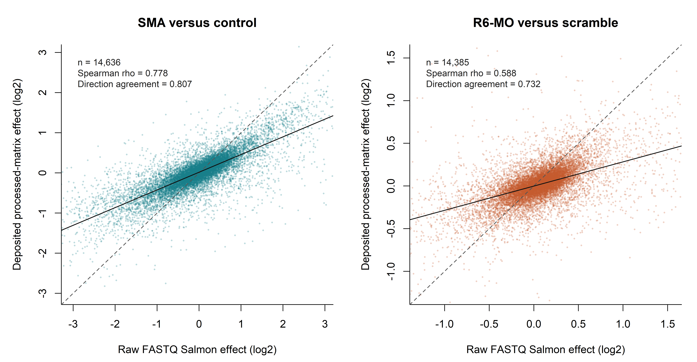
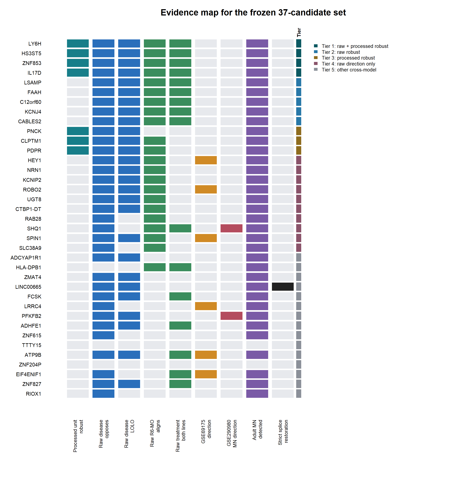

# Raw-confirmed cross-model analysis identifies reproducible human motor-neuron resilience candidates in spinal muscular atrophy

**Running title:** Cross-model motor-neuron resilience in SMA

**Article type:** Original research

**Authors and affiliations:** To be supplied before submission

## Abstract

**Background:** Spinal muscular atrophy (SMA) is caused by deficiency of
survival motor neuron (SMN) protein, yet motor-neuron populations differ in
their vulnerability. We asked whether expression directions associated with
relative human oculomotor-neuron resistance recur as opposing disease changes
and SMN-directed responses across human SMA models.

**Methods:** We integrated donor-aware bulk RNA-seq from human post-mortem
oculomotor and spinal motor neurons (GSE93939), human SMA spinal-cord organoids
with R6-morpholino treatment (GSE290979), and an independent iPSC-derived SMA
motor-neuron cohort (GSE108094). GSE69175 provided held-out directional
sensitivity evidence. GSE290980 and GSE243076 supplied same-study SMA
cell-resolved context and independent adult spinal motor-neuron localization,
respectively. Models were fitted within datasets and integrated only after
effect orientation and HGNC symbol harmonization. Candidate robustness was
tested by leave-one-donor, leave-one-line, and leave-one-dataset-out analyses.
Complete checksum-verified FASTQs from nine pre-specified GSE290979 libraries
were independently re-quantified from raw reads with Salmon against GENCODE
v47, followed by donor-line-aware analysis without random sample splitting.

**Results:** Among 11,326 ranked approved genes, 37 met a frozen exploratory
natural-resistance criterion and the complete cross-model direction pattern.
Raw and deposited processed effects agreed across 14,636 disease genes
(Spearman rho 0.778; direction agreement 0.807) and 14,385 treatment genes
(rho 0.588; direction agreement 0.732). Thirty-five of 37 candidates mapped
in both raw contrasts, 21 recovered the full raw direction pattern, and nine
retained that pattern across five disease line omissions and both treatment
lines. `LY6H`, `HS3ST5`, `ZNF853`, and `IL17D` were unit-robust in both the
processed and raw analyses. Five additional genes were raw-unit robust and
three retained processed-unit robustness. No candidate was supported by all
robustness, GSE69175, and motor-neuron-specific disease annotations.

**Conclusions:** Complementary human models nominate a small, reproducible set
of resilience-associated hypotheses while revealing substantial
model-specific biology. The results prioritize genes for experimental
perturbation but do not establish neuroprotection, therapeutic efficacy, or
SMN2 splice correction.

**Keywords:** spinal muscular atrophy; motor neuron; oculomotor neuron;
resilience; RNA sequencing; raw-read re-quantification; donor-aware analysis;
SMN

## Introduction

Spinal muscular atrophy is an inherited motor-neuron disease caused by loss or
mutation of `SMN1`. The paralog `SMN2` produces insufficient full-length SMN
protein because most transcripts exclude exon 7. SMN-restoring therapies have
changed clinical care, but incomplete response and the selective vulnerability
of motor neurons motivate investigation of additional disease-modifying
programs.

Motor-neuron populations are not equally vulnerable to degeneration.
Oculomotor neurons are relatively resistant in several motor-neuron diseases,
whereas spinal motor neurons are prominently affected. Expression differences
between these populations can therefore provide a natural-resistance prior.
Such differences cannot by themselves identify SMA mechanisms: post-mortem
anatomical comparisons are influenced by region, cell state, age, technical
platform, and donor composition. A stronger strategy is to ask whether the
same gene directions recur across mechanistically distinct human systems.

We designed a cross-model analysis with GSE93939 retained as the human
natural-resistance anchor rather than treated as a standalone discovery
cohort. Candidate directions were required to oppose SMA disease in a human
organoid model, align with an SMN-directed response, and oppose disease in an
independent iPSC-derived motor-neuron model. We then separated discovery from
validation by freezing the candidate set before biological-unit holdouts,
external sensitivity annotations, cell-resolved localization, and raw-read
re-quantification.

Our primary objective was not to derive a clinical target list. It was to
identify reproducible, experimentally testable human genes whose directions
are consistent with relative motor-neuron resilience while making low donor
power, cell mixing, and same-study dependence explicit.

## Methods

### Study design and datasets

All analyzed datasets were Homo sapiens. GSE93939 contained 39
laser-capture RNA-seq libraries from post-mortem oculomotor, spinal, and
Onuf's nucleus motor neurons. The primary oculomotor-versus-spinal comparison
used 32 libraries from 19 donors. GSE290979 contained 31 bulk RNA-seq
libraries from spinal-cord organoids generated from three control and two SMA
type I donor lines, including R6-morpholino and scramble-treated organoids from
two SMA lines. These were the two core datasets satisfying the pre-specified
20-library threshold.

GSE108094 contained eight iPSC-derived spinal motor-neuron libraries from two
control and two SMA lines and served as independent disease-direction
validation. GSE69175 contained two libraries from one control line and two
from one SMA type I line after motor-neuron purification. Because genotype was
completely confounded with line, GSE69175 was used only as held-out
directional sensitivity evidence.

GSE290980 was the single-cell arm linked to GSE290979 and was used to localize
SMA-associated effects to author-defined cell types, including motor neurons.
It was not labeled independent. GSE243076 was an independent adult human
spinal-cord single-nucleus atlas from nine donors and was used to assess
candidate detection and localization in the `CHAT`/`SLC5A7` motor-neuron
cluster, not SMA disease direction.

### Dataset-specific expression models

GSE93939 counts were TMM-normalized and modeled with limma-voom quality
weights. The model adjusted for sex, age, post-mortem delay, tissue source,
and sequencing platform and accounted for repeated libraries from donors.
Sensitivity analyses used 25 HiSeq 2000 libraries and 13 same-platform donor
pseudobulks.

For GSE290979, technical preparations were summed within donor-line
conditions. The untreated disease contrast used five donor-line pseudobulks
(three control and two SMA). The R6-morpholino versus scramble contrast used
two paired SMA donor lines. edgeR models reported effect sizes, nominal
probabilities, and false-discovery rates. The treatment lines were also
evaluated separately because leaving out either of two lines eliminates
residual biological replication.

Official GSE108094 and GSE69175 group-level outputs were orientation-audited
against their deposited expression values. Their source probabilities were
retained as context, but integration used effect direction. Genes were mapped
to current, unambiguous HGNC symbols before cross-dataset comparison.

### Cross-model integration

Four oriented evidence components were defined:

1. GSE93939 oculomotor minus spinal motor-neuron expression.
2. Negative GSE290979 SMA-minus-control expression.
3. GSE290979 R6-morpholino-minus-scramble expression.
4. Negative GSE108094 SMA-minus-control expression.

Each effect was converted to a percentile among approved genes with complete
evidence. The cross-model score was the unweighted mean of the four
percentiles and was not interpreted as a combined probability or causal
effect. A complete resilience pattern required positive natural-resistance
and treatment effects and negative disease effects in both SMA models.

The ranked universe contained 11,326 genes. The candidate set was frozen at
37 genes that additionally met the exploratory GSE93939 rule: positive
primary effect with nominal `p < 0.05`, positive same-platform effect, and
same-platform `p < 0.10`. GSE93939 false-discovery rates remained visible and
the genes were not described as statistically validated natural-resistance
markers.

### Biological-unit and dataset holdouts

The GSE93939 primary model was refitted after omission of each of 19 donors.
The same-platform model used 13 donor omissions. The GSE290979 disease model
was refitted after omission of each of five donor lines. Treatment robustness
required concordant complete-model, S2, and S3 directions; formal treatment
LOLO was not estimable. Candidate ranks were also recomputed after separately
omitting GSE93939, GSE290979, or GSE108094 as a complete evidence source.
There was no random library-level train/test split.

### Raw-read re-quantification

Nine GSE290979 libraries were selected before outcome analysis: one complete
technical preparation for each of the five untreated donor-line conditions
and each of the four paired treatment conditions. Selection minimized distance
from the median read-pair count within a line-condition, with run accession as
a deterministic tie-breaker. The selected input totaled 82.193 GiB.

Both paired FASTQ files for every selected library were downloaded from ENA
and required to match deposited MD5 values. Salmon 1.10.2 quantified complete
paired reads against the GENCODE v47 transcriptome using automatic library
detection, validated mappings, sequence-bias correction, and GC-bias
correction. Transcript estimates were summarized to genes with tximport using
`countsFromAbundance="lengthScaledTPM"`.

The raw gene matrix was analyzed with the same five-line disease and paired
two-line treatment structures. Five disease LOLO effects and separate S2 and
S3 treatment effects were calculated. Raw effects were compared with the
deposited processed matrix only after quantification and modeling. A 13-check
integrity gate verified sample order, biological-unit counts, quantification
decisions, holdout completeness, concordance tables, candidate integrity, and
absence of random splitting.

This procedure is transcriptome re-quantification rather than whole-genome
alignment. It does not provide raw splice-junction discovery or
paralog-specific `SMN1`/`SMN2` quantification.

### Publication evidence tiers

The original cross-model rank was frozen. Raw evidence was not added to the
discovery score because it reuses GSE290979 biological material. Tier 1
required biological-unit direction robustness in both processed and raw
analyses. Tier 2 required raw-unit robustness only. Tier 3 required
processed-unit robustness only. Tier 4 contained other candidates with the
complete raw direction pattern, and Tier 5 contained the remaining frozen
cross-model candidates. GSE69175 and cell-resolved annotations were displayed
separately and did not change tiers.

### Reproducibility

All analysis was scripted in R. Source resource hashes, sample sheets, dataset
roles, resampling rules, and raw-read completion contracts were locked before
publication integration. A synthetic regression test exercised all evidence
tiers. The final validator checks exact dataset dimensions, holdout counts,
candidate identities, raw concordance statistics, frozen ranks, publication
scope, and absence of random analytical splits.

## Results

### Donor-aware analysis limits single-dataset claims

No GSE93939 oculomotor-positive gene reached FDR below 0.05 in the adjusted
primary model, and neither primary GSE290979 expression contrast produced a
donor-line-level FDR hit. These results discouraged hit-list interpretation
of either core dataset. The processed GSE290979 splicing audit identified 83
strict corrected events across 74 genes, but these events remain
workbook-derived until complete raw junction-level validation is performed.

### Cross-model direction identifies 37 exploratory candidates

Of 11,326 approved genes with complete four-component evidence, 626 followed
the complete resilience direction and 468 followed the inverse pattern.
Thirty-seven resilience-direction genes also met the frozen exploratory
GSE93939 criterion. Genome-wide cross-model correlations were weak
(`|rho| < 0.12`), indicating that the intersection represented focused
directional recurrence rather than a shared global transcriptomic program.

Seven of 37 candidates passed every estimable processed biological-unit check:
`LY6H`, `HS3ST5`, `ZNF853`, `PNCK`, `IL17D`, `CLPTM1`, and `PDPR`.
Six different genes had GSE69175 disease-opposition support: `ROBO2`, `ATP9B`,
`HEY1`, `LRRC4`, `SPIN1`, and `EIF4ENIF1`. The sets did not overlap.

### All-nine raw-read analysis confirms broad effect direction

All 18 FASTQ files from the nine pre-specified libraries passed deposited ENA
checksums and all nine Salmon quantifications passed their decision gates.
The final integrity table passed 13 of 13 checks.

Raw and deposited processed effects showed substantial concordance for
SMA versus control across 14,636 genes (Spearman rho 0.778; Pearson
`r = 0.784`; direction agreement 0.807). R6-morpholino versus scramble
concordance was lower but positive across 14,385 genes (rho 0.588;
`r = 0.553`; direction agreement 0.732; Figure 1).

Thirty-five frozen candidates mapped in both raw contrasts. Twenty-one
retained disease opposition and R6-morpholino alignment in the raw analysis.
Nine additionally retained disease direction in all five LOLO folds and
treatment direction in both SMA lines. Three candidates had raw disease
nominal `p < 0.05` (`ADCYAP1R1`, `LY6H`, and `PNCK`), none had disease
FDR below 0.05, and no candidate had raw treatment nominal `p < 0.05`.
Accordingly, tiering emphasized direction and biological-unit stability rather
than statistical significance.

### Four candidates are robust in processed and raw unit analyses

Tier 1 contained `LY6H`, `HS3ST5`, `ZNF853`, and `IL17D`, which retained the
planned direction across all estimable processed and raw biological-unit
checks. Tier 2 added five raw-unit-robust genes: `LSAMP`, `FAAH`, `C12orf60`,
`KCNJ4`, and `CABLES2`. Tier 3 retained three processed-unit-robust genes that
did not satisfy the complete raw unit criterion: `PNCK`, `CLPTM1`, and `PDPR`.
Together, 12 genes were unit-robust in at least one quantification analysis.

The raw analysis did not simply reproduce the processed candidate set.
`PNCK`, for example, retained a strong raw disease effect but not the expected
raw treatment direction. Conversely, the five Tier 2 genes gained unit-level
support only after raw re-quantification. The evidence map therefore reports
each component separately rather than presenting a single revised score
(Figure 2).

### Cell-resolved data refine rather than validate the shortlist

Five of 37 candidates appeared in the same-study GSE290980 motor-neuron
differential-expression list. `PFKFB2` and `SHQ1` had the expected
SMA-opposed direction. Neither was raw-unit robust, and none of the nine
raw-unit-robust genes carried this motor-neuron disease-direction annotation.

Thirty-five candidates were detected in the independent adult GSE243076
motor-neuron cluster, but none met the stringent motor-neuron-selective
localization rule. These results show that most candidates are expressed in
adult motor neurons but do not establish motor-neuron specificity.

### Splice restoration remains a distinct evidence track

`LINC00665` was the only member of the 37-gene set with a strict processed
GSE290979 splice-restoration event. It was not among the raw-unit-robust
expression candidates. This separation supports treating total-expression
resilience and splice correction as related but non-interchangeable
hypotheses. No genome-wide raw splice claim is made.

## Discussion

This analysis reframes human oculomotor-neuron expression as one directional
evidence source within a cross-model SMA study. That choice preserves the
biological value of naturally resistant neurons without requiring the
post-mortem dataset to produce a large FDR-significant gene list. The weak
global correlations between models argue against a universal resilience
signature, whereas the smaller directional intersection provides a
transparent source of experimental hypotheses.

The all-nine raw-read analysis addresses an important reproducibility concern.
Counts and effects no longer depend solely on the deposited GSE290979
processed matrix for the selected libraries. Disease concordance was strong,
and treatment concordance was moderate despite only two treated donor lines.
Four genes survived both the original and raw biological-unit criteria.
`LY6H` and `HS3ST5` also retained high frozen cross-model ranks, while
`ZNF853` and `IL17D` show that reproducibility and original rank provide
different information.

The five Tier 2 genes deserve focused follow-up because raw analysis increased
their unit-level support. The three Tier 3 genes remain relevant because
failure of the raw criterion may reflect treatment-line instability,
quantification differences, or limited power rather than absence of biology.
The tiers are therefore evidence labels, not proof of a causal hierarchy.

External results also prevent an overly simple conclusion. The purified
GSE69175 direction-supported genes did not overlap the processed or raw
unit-robust sets, and the same-study motor-neuron disease annotation did not
overlap the raw-unit-robust set. This lack of convergence is scientifically
informative: current public datasets do not identify a candidate supported
across anatomy, organoid disease, treatment response, purified patient motor
neurons, and motor-neuron-resolved disease effects.

The appropriate next experiment is a donor-expanded, motor-neuron-resolved
perturbation study. Tier 1 genes provide the most reproducible starting set
for testing whether modulation changes axonal growth, electrophysiology,
stress response, SMN-dependent phenotypes, or survival. Such experiments must
measure function and cannot infer benefit from expression direction alone.

## Limitations

First, the effective biological sample size is modest: 19 donors in the
primary anatomical comparison and five donor lines in GSE290979, with only
two SMA lines in the treatment arm. Technical libraries do not increase these
numbers.

Second, GSE93939 compares different anatomical regions in post-mortem tissue
and is not an SMA cohort. Residual regional or donor effects may remain despite
adjustment and same-platform analyses.

Third, GSE290979 bulk organoids contain mixed cell populations. GSE290980
helps localize effects but overlaps the study and has only two lines per
genotype. GSE243076 tests adult motor-neuron localization, not SMA direction.

Fourth, GSE69175 has one line per genotype, and GSE108094 public processed
outputs do not permit the same raw line-aware model used for GSE290979.

Fifth, the raw analysis uses nine pre-specified libraries from the 31-library
study. It preserves all disease donor lines and both treatment lines but does
not reproduce every technical preparation. It is same-study sensitivity
confirmation rather than independent validation.

Sixth, Salmon was run against a transcriptome-only, non-decoy-aware index.
Possible genomic misassignment cannot be excluded. The analysis is not
whole-genome alignment and is not suitable for definitive discrimination of
highly homologous `SMN1` and `SMN2` reads.

Seventh, the strict splice-restoration results are derived from deposited
processed values. A complete 31-library genome alignment and raw junction
analysis, or orthogonal junction assays, is required before making
workbook-independent genome-wide splicing claims.

Finally, candidate tiers are based primarily on direction stability, not
multiple-testing significance or functional assays. They must not be
interpreted as therapeutic recommendations.

## Conclusions

A donor-aware, cross-model analysis retained GSE93939 as a natural-resistance
anchor and identified 37 exploratory human resilience-direction candidates.
All-nine raw GSE290979 re-quantification supported broad reproducibility of
disease and treatment effects and identified four genes robust across both raw
and processed biological-unit analyses. The resulting tiered shortlist is a
reproducible experimental prioritization framework. It is not evidence that
any gene protects patients or increases full-length SMN2 protein.

## Data and Code Availability

All source sequencing datasets are publicly available through NCBI GEO under
GSE93939, GSE290979, GSE108094, GSE69175, GSE290980, and GSE243076. Raw
GSE290979 reads were obtained through ENA using the locked run manifest in the
repository.

Analysis code, frozen configuration files, tests, documentation, and tracked
publication outputs are available at:
<https://github.com/mysunatislam/smn2-resilience-raw-confirmation>.

Large downloaded FASTQs, generated count matrices, and local statistical
outputs are excluded from Git. Their checksums, provenance contracts, and
regeneration commands are included in the repository. Verified FASTQs and
existing BAMs used locally were preserved after analysis.

## Ethics Statement

This study re-analyzed publicly available, de-identified datasets. No new
human participants or animals were enrolled.

## Competing Interests

To be completed by the authors before submission.

## Funding

To be completed by the authors before submission.

## Author Contributions

To be completed by the authors before submission.

## Figure Legends

**Figure 1. Raw-read re-quantification versus deposited processed-matrix
effects.** Each point is a gene with finite effects in both analyses. Dashed
lines show identity and solid lines show ordinary least-squares fits. Raw
counts were generated from nine complete, checksum-verified FASTQ pairs with
Salmon and were not derived from the processed workbook.

**Figure 2. Evidence map for the frozen 37-candidate set.** Rows are ordered
by publication evidence tier and then by the unchanged cross-model discovery
rank. Colored cells indicate support for the named evidence component; light
gray indicates no support. The right strip denotes publication tier.
GSE69175, GSE290980, adult motor-neuron detection, and strict splice
restoration are annotations and do not alter the tier.

## Supplementary Figure Legends

**[Supplementary Figure S1. GSE93939 donor-aware sample
structure.](figures/supplementary_figure_S1_GSE93939_MDS.png)** MDS of
TMM-normalized human motor-neuron libraries used for the natural-resistance
contrast, colored by oculomotor or spinal identity.

**[Supplementary Figure S2. GSE93939 primary-versus-sensitivity effect
agreement.](figures/supplementary_figure_S2_GSE93939_sensitivity.png)**
Genome-wide agreement between the adjusted primary oculomotor-versus-spinal
effect and the HiSeq 2000 sensitivity analysis.

**[Supplementary Figure S3. GSE290979 donor-line disease sample
structure.](figures/supplementary_figure_S3_GSE290979_MDS.png)** MDS of the
control and SMA donor-line pseudobulks used for the disease contrast.

**[Supplementary Figure S4. Cross-model resilience
shortlist.](figures/supplementary_figure_S4_cross_model_top25.png)** Component
support scores for the top 25 genes in the frozen 37-gene cross-model
candidate set.

**[Supplementary Figure S5. Natural resistance versus independent SMA
direction.](figures/supplementary_figure_S5_natural_vs_external.png)**
Percentile agreement between GSE93939 natural resistance and the independent
GSE108094 iPSC motor-neuron SMA-opposition signal, with ranked candidates
highlighted.

**[Supplementary Figure S6. Biological-unit and dataset-holdout
robustness.](figures/supplementary_figure_S6_holdout_robustness.png)**
Candidate-level support under donor, donor-line, treatment-line, and external
dataset holdouts.

**[Supplementary Figure S7. Cell-resolved GSE290980 motor-neuron disease
effects.](figures/supplementary_figure_S7_GSE290980_MN_DEGs.png)** Largest
positive and negative SMA-minus-control pseudobulk effects in the annotated
motor-neuron population.

**[Supplementary Figure S8. Independent adult motor-neuron cluster
markers.](figures/supplementary_figure_S8_GSE243076_MN_markers.png)** Genes
with the strongest expression enrichment in the audited GSE243076 C20
motor-neuron cluster relative to other neuronal clusters.

**[Supplementary Figure S9. Cell-resolved candidate
context.](figures/supplementary_figure_S9_cell_resolved_context.png)**
Independent adult motor-neuron enrichment plotted against the GSE290980
motor-neuron SMA-minus-control effect for cross-model candidates.

**[Supplementary Figure S10. Splicing-panel score
components.](figures/supplementary_figure_S10_splicing_panel_components.png)**
Effect, false-discovery, biotype, junction-support, and assay components for
the 12-event validation panel.

**[Supplementary Figure S11. Strict splicing-event validation
priority.](figures/supplementary_figure_S11_splicing_priority.png)** Top 20
corrected splicing events ranked by the locked validation-priority score and
colored by event class. This is processed-data prioritization, not raw
junction-level validation.

## Supplementary Tables

**Supplementary Table S1.** Frozen cross-model candidates with original
effects and ranks, processed biological-unit robustness, raw FASTQ
re-quantification results, publication tier, external sensitivity, and
cell-resolved annotations.

**Supplementary Table S2.** Locked publication analysis scope, integrity
counts, tier sizes, and tier gene identities.

**Supplementary Table S3.** Genome-wide raw-versus-processed concordance for
the GSE290979 disease and treatment contrasts.

## References

1. NCBI GEO GSE93939. RNA-seq of laser-captured human oculomotor, spinal, and
   Onuf's nucleus motor neurons. PubMed: 31080111; 32065260.
2. NCBI GEO GSE290979 and GSE290980. Targeted antisense oligonucleotide
   treatment rescues developmental alterations in spinal muscular atrophy
   organoids. PubMed: 41423447.
3. NCBI GEO GSE108094. Next-generation sequencing of human SMA and healthy
   control motor neurons. PubMed: 30649277.
4. NCBI GEO GSE69175. Selective death in spinal muscular atrophy: genome-wide
   RNA-seq using purified patient-derived motor neurons. PubMed: 26321202.
5. NCBI GEO GSE243076. Spatial transcriptomics and single-nucleus RNA
   sequencing reveal a transcriptomic atlas of human spinal cord. PubMed:
   38289829; 38934400.
6. Robinson MD, McCarthy DJ, Smyth GK. edgeR: a Bioconductor package for
   differential expression analysis of digital gene expression data.
   Bioinformatics. 2010.
7. Law CW, Chen Y, Shi W, Smyth GK. voom: precision weights unlock linear
   model analysis tools for RNA-seq read counts. Genome Biology. 2014.
8. Ritchie ME, et al. limma powers differential expression analyses for
   RNA-sequencing and microarray studies. Nucleic Acids Research. 2015.
9. Patro R, Duggal G, Love MI, Irizarry RA, Kingsford C. Salmon provides fast
   and bias-aware quantification of transcript expression. Nature Methods.
   2017.
10. Soneson C, Love MI, Robinson MD. Differential analyses for RNA-seq:
    transcript-level estimates improve gene-level inferences. F1000Research.
    2015.
11. Frankish A, et al. GENCODE 2021. Nucleic Acids Research. 2021.
